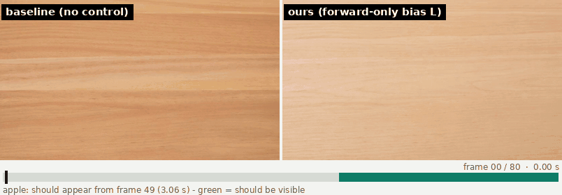
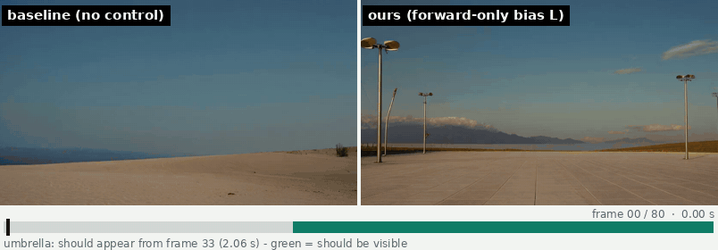
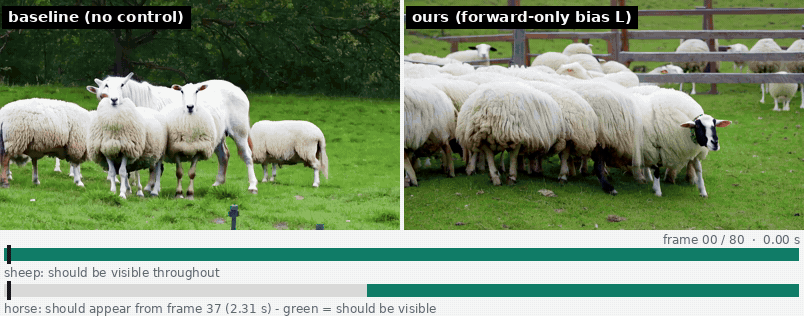
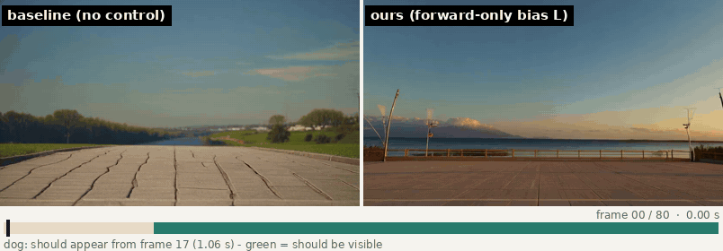
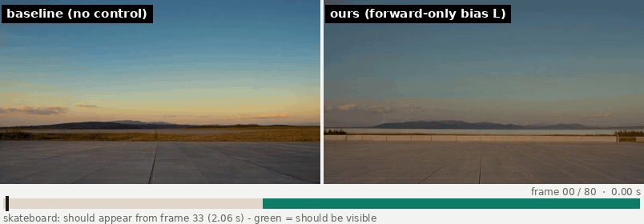

# Real-Time Video Diffusion on One GPU

**Where Self-Forcing spends its time, and forward-only control of *when* an object appears**

[](https://liadMor123.github.io/wan-realtime-control/)
[](report/report.pdf)
[](LICENSE)

Liad Mordechai · Technion, Computer Architecture final project (Prof. Avi Mendelson, Mr. Yaniv Nemcovsky) · 2026

## Abstract

Real-time text-to-video generation puts two demands on one GPU: every chunk of frames must be produced within a latency budget, and the result must follow the prompt, including *when* things happen. This repository holds two controlled studies on the same model family, **Wan2.1-T2V-1.3B** and its chunk-wise autoregressive distillation **Self-Forcing**, measured on a single NVIDIA A100-SXM4-40GB.

**Part A (latency)** asks where a streaming video diffusion transformer spends its time after CUDA graphs and whether the persistent-megakernel result from LLM decode transfers. Kernel-launch boundaries turn out to be worth about 1% of chunk time; the dominant recoverable cost is a wave-quantization tail inside FlashAttention-2 (19.2% of attention time), and an off-the-shelf split-KV dispatch recovers it entirely, so a persistent kernel is not justified on this configuration. The integrated conventional fixes cut chunk-6 latency by 23.4% (1,498 → 1,147 ms).

**Part B (timing control)** asks whether TempoControl's gradient-based control of an object's appearance time (≈2.6× sampling time, ≈110 GB of memory) can be replaced by a forward-only edit. A per-frame logit bias on the object's text tokens in cross-attention (+2 on frames where the object should be visible, −2 elsewhere) raises TempoControl's official temporal-accuracy metric by **+15.5 points** on all 80 single-object prompts, by **+9.6** on all 82 two-object pairs, and by **+25.8 points inside real-time Self-Forcing**, where gradient methods cannot run at all, at **+0.8-1.6% time and no extra memory** on a 40 GB GPU.

## Examples

Same prompt, same seed, generated twice: the unmodified model on the left, the same model with our forward-only per-frame attention bias on the right. Nothing else differs. The bar under each pair is the prompt's visibility schedule: green frames are where the object should be visible, grey where it should not, and the black marker is the current frame. Accuracy is TempoControl's official metric for that video (share of 20 sampled frames in which the object is detected exactly when it should be).

<table>
<tr><th width="50%">Wan2.1-T2V-1.3B</th><th width="50%">Self-Forcing (real-time streaming)</th></tr>
<tr>
<td>
<br>
<em>"An empty scene. Suddenly, during the <b>fourth second</b> of the video, an <b>apple</b> appears out of nowhere, drawing all attention."</em><br>
accuracy 0.70 → <b>0.85</b>
</td>
<td>
<br>
<em>"An empty scene. Suddenly, during the <b>third second</b> of the video, an <b>umbrella</b> appears out of nowhere, drawing all attention."</em><br>
accuracy 0.75 → <b>0.90</b>
</td>
</tr>
<tr>
<td>
<br>
<em>"The video begins with a serene view centered on the <b>sheep</b>, with no sign of the horse. Suddenly, in the <b>second half</b>, the <b>horse</b> unexpectedly appears, altering the dynamic of the scene."</em><br>
accuracy 0.29 → <b>0.95</b>
</td>
<td>
<br>
<em>"An empty scene. Suddenly, during the <b>second second</b> of the video, a <b>dog</b> appears out of nowhere, drawing all attention."</em><br>
accuracy 0.90 → <b>0.95</b>
</td>
</tr>
<tr>
<td></td>
<td>
<br>
<em>"An empty scene. Suddenly, during the <b>third second</b> of the video, a <b>skateboard</b> appears out of nowhere, drawing all attention."</em><br>
accuracy 0.55 → <b>0.90</b>
</td>
</tr>
</table>

More examples, including the pairs where the bias did not help, are on the [project page](https://liadMor123.github.io/wan-realtime-control/).

## Results

### Part A: latency attribution (Self-Forcing, A100-40GB)

| Component priced by controlled intervention | Measured |
|---|---|
| Kernel-launch boundaries after fusion (what a megakernel removes) | 3.11 ms/pass ≈ 1% of chunk time |
| Host-device sync sites on the per-pass path | 9.60 ms/pass, removed byte-identically |
| RoPE → KV-cache materialization | 19.7 ms/pass; 10.7 recovered byte-identically |
| Inductor fusion and kernel selection | 26.8 ms/pass |
| FlashAttention-2 wave-quantization tail (444 CTAs on 108 SMs) | 19.2% of attention time; the only cost clearing the pre-registered 5% gate |
| `flash_attn_with_kvcache(num_splits=4)` | recovers 19.5% → residual not measurable → persistent kernel **not justified** |
| Fused split-KV-merge + out-projection Triton kernel | numerically exact, **+20 ms/pass slower** (register budget; tensor pipe 9% active) |

| Mode | chunk 0 | chunk 3 | chunk 6 (ms) |
|---|---|---|---|
| eager-original | 803.7 | 1146.8 | 1498.3 |
| **final** (sync sites removed, cache-write fusion, Inductor, CUDA graphs, split-KV) | **559.0** | **855.9** | **1147.0** |

### Part B: temporal accuracy (TempoControl's official metric)

| Setting | Baseline | Ours (L, β=γ=2) | Δ points [95% CI] | TempoControl (reported) |
|---|---|---|---|---|
| Wan2.1, all 80 single-object prompts | 0.695 | **0.850** | +15.5 [+11.1, +20.2] | 0.639 → 0.836 (+19.7) |
| Self-Forcing, 80 prompts, seed 42 | 0.617 | **0.875** | +25.8 [+20.8, +30.9] | cannot run |
| Self-Forcing, 80 prompts, seed 43 | 0.601 | **0.843** | +24.2 [+19.1, +29.5] | cannot run |
| Wan2.1, all 82 two-object pairs | 0.376 | **0.472** | +9.6 [+4.2, +15.0] | 0.375 → 0.532 (+15.7) |

| Cost | TempoControl | Ours |
|---|---|---|
| Time per video | ≈2.6× baseline | +0.8% (explicit attention path), +1.58% inside Wan's own FlashAttention-2 kernel |
| Peak GPU memory | ≈110 GB | 13.8 GB (unchanged from the baseline) |

All costs are pre-registered and reported: VBench imaging quality drops by 0.043, CLIP prompt similarity by 0.01, and a blinded count finds substitute objects in 7 of 80 streaming videos (prompt switching: 0). The method is essentially TS-Attn (arXiv 2604.19473) specialised to one object; the contribution is the measurement. Full method, every test and every miss: [`report/report.pdf`](report/report.pdf).

## Method in one paragraph

In every one of Wan's 30 transformer blocks each video token attends to the same 512 text tokens, and the text encoder has no notion of frames, so boosting the timing words pushes every frame identically. Timing has to enter *per frame*. Arm **L** adds a bias to the cross-attention logits of the object's text tokens: +β for queries in latent frames where the object should be visible, −γ where it should not (β = γ = 2, conditional CFG branch only, all blocks and heads). Because the bias is rank-1 per frame it rides inside an unmodified FlashAttention-2 call through eight extra head dimensions (128 → 136): `q` carries the per-frame bias, the object keys carry constants summing to 1/scale, `v` is zero-padded; with a zero table the output is bitwise equal to Wan's own flash call. In Self-Forcing the same table is indexed by each chunk's frame offset and applied in every pass.

## Repository layout

```
report/      report.tex, report.pdf, figures/      the combined pseudo-paper
assets/      side-by-side GIFs shown above
docs/        GitHub Pages site (project page, 14 example video pairs, figures, report)
latency/     Part A  - timing harness, kernel census, FA2 tail sweep, split-KV benchmark,
                       Triton fused-merge kernel, Slurm jobs, results JSON, figures      -> latency/README.md
tempo/       Part B  - tempo_ctrl library (cross-attention arms, FA2 head augmentation, sampler,
                       masks, tokens), scripts, tests, Slurm jobs, run configs, results    -> tempo/README.md
```

Each part has its own README with a table of every script and module, the run order, environment pins and the results files.

## Setup and reproduction

Everything was run on A100-SXM4-40GB nodes of a Slurm cluster with:

| Component | Pin |
|---|---|
| PyTorch / Triton / flash-attn | 2.7.1+cu126 / 3.3.1 / 2.8.3.post1 |
| Self-Forcing | `guandeh17/Self-Forcing` @ `33593df3` (Part A patch series applied on top) |
| Wan2.1 | `Wan-AI/Wan2.1` @ `9737cba`, unmodified (cross-attention patched at runtime) |
| TempoControl | `ac28c443`, benchmark CSVs and `temporal_accuracy.py` used unmodified |
| Metric environment | YOLOv10 fork `453c6e38`, `huggingface_hub==0.23.4`, VBench 0.1.5, OpenCLIP ViT-L-14-quickgelu |

```bash
# Part A: regenerate every figure from the recorded results (no GPU)
python3 latency/src/plotting/make_figures.py

# Part B: CPU unit tests (masks, token lookup, FA2 head-augmentation emulation, two objects, prompt switching)
TEMPO_ROOT=$PWD/tempo python3 -m pytest tempo/tests -q

# Part B: a benchmark run is a sequence of Slurm jobs; see tempo/README.md ("Running the benchmark")
sbatch tempo/slurm/validate_pipeline.sbatch
```

Model weights, the ≈850 MB of generated videos and contact sheets, and the Self-Forcing patch series are not in this repository. Cluster-specific home paths appear as `/home/USER`.

## Upstream and credits

Wan2.1 (Wan-AI), Self-Forcing (guandeh17), FlashAttention-2 (Dao-AILab), TempoControl (benchmark and metric, used unmodified), YOLOv10, VBench. All code under `latency/src`, `latency/scripts`, `tempo/src`, `tempo/scripts` and `tempo/tests` is this project's own.

## Citation

```bibtex
@misc{mordechai2026wanrealtimecontrol,
  title  = {Real-Time Video Diffusion on One GPU: Where Self-Forcing Spends Its Time, and Forward-Only Control of When an Object Appears},
  author = {Mordechai, Liad},
  year   = {2026},
  note   = {Computer Architecture final project, Technion},
  url    = {https://github.com/liadMor123/wan-realtime-control}
}
```
